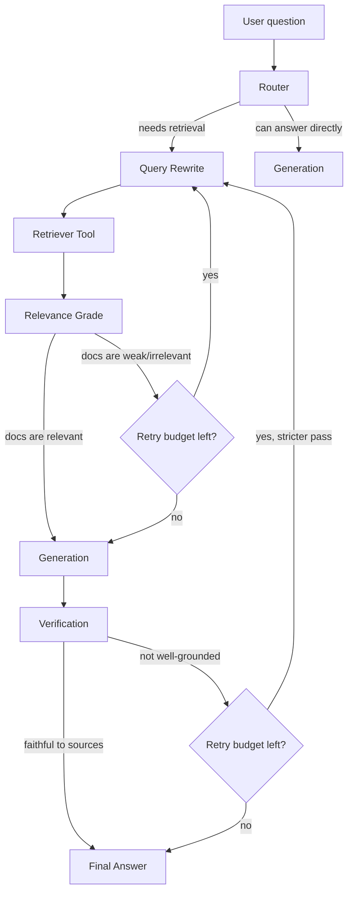

# Agentic RAG:

An end-to-end FastAPI project demonstrating **RAG + an autonomous agent**. Instead of always doing a fixed "retrieve then generate" sequence, the agent _reasons_ about the question first — deciding whether retrieval is even needed, how to phrase the search, whether what came back is actually useful, and whether the final answer is trustworthy enough to return.

---

## What is Agentic RAG?

**RAG (Retrieval-Augmented Generation)** is a way of making an LLM's answers more accurate and grounded by handing it relevant facts before it responds. It has two ingredients:

1. **An external knowledge source** — a vector DB, a search API, a plain database, a file, or any tool that holds facts the model wasn't trained on (or that changes too often to bake into the model).
2. **A generator** — the LLM that reads those facts and writes the final answer.

In _plain_ RAG, the flow is fixed and mechanical: question comes in → always retrieve → stuff the results into a prompt → generate an answer. No matter how good or bad the question or the retrieved documents are, the pipeline doesn't adapt.

**Agentic RAG** adds a second ingredient: an **autonomous agent** sitting in front of (and around) that retrieval step, making decisions instead of following a fixed script. The agent reasons about:

1. **When to retrieve** — is this question even something that needs external facts, or can it be answered directly?
2. **What to retrieve** — should the raw question be rewritten into a better search query first?
3. **Where to retrieve** — which tool/source is the right one for this question (local JSON, a vector DB, an API)?
4. **How many times to retrieve** — if the first attempt returns weak or irrelevant results, should the agent rewrite the query and try again?

So the two core components of any Agentic RAG system are:

- **The autonomous agent** — the "brain" that plans the workflow step by step (built here with LangGraph).
- **RAG itself** — the external data source and retrieval mechanism it calls into (here: a local JSON file, or OpenSearch as a swappable backend).

## How this project's pipeline works

The service is built as a small state machine (a LangGraph graph). Each box below is a node the state passes through, and the state itself — defined in `app/agents/state.py` — carries `question`, `rewritten_query`, `retrieved_docs`, `relevance_grade`, `retry_count`, `draft_answer`, and `final_answer` as it moves along.



Step by step, in plain terms:

1. **Router** — looks at the question and decides if retrieval is worth doing at all. A greeting or a question the model can already answer safely doesn't need a trip to the knowledge base.
2. **Query rewrite** — turns the user's raw wording into a cleaner, more search-friendly query (useful for vague or ambiguous questions like _"Explain the rule about being ahead of defenders"_ → rewritten toward _"offside rule football"_).
3. **Retriever tool** — actually fetches candidate documents, from the local JSON file by default, or OpenSearch when configured.
4. **Relevance grade** — checks whether what came back actually answers the question. If not, and there's retry budget left, the loop goes back to query rewriting with a fresh angle.
5. **Generation** — the LLM drafts an answer using only the retrieved, relevant documents as grounding.
6. **Verification** — checks the draft against the source documents for faithfulness (i.e., is the model making things up, or is every claim traceable back to a retrieved doc?). If it's not well-grounded and retries remain, the pipeline loops back for a stricter retrieval pass; otherwise it returns what it has.
7. **Final answer** — returned to the caller via the `/v1/ask` endpoint.

The `retry_count` in the state caps how many times steps 2–4 (and 2–6) can loop, so the agent can't spin forever on a bad question.

## Traditional RAG vs. Agentic RAG

|                                   | Traditional RAG                                             | Agentic RAG (this project)                                                                                           |
| --------------------------------- | ----------------------------------------------------------- | -------------------------------------------------------------------------------------------------------------------- |
| **Retrieval trigger**             | Always retrieves, for every question                        | Router decides _whether_ retrieval is needed at all                                                                  |
| **Query used for search**         | The user's raw question, unmodified                         | Rewritten/optimized query, and rewritten again on retry                                                              |
| **Number of retrieval attempts**  | Exactly one, no matter the result quality                   | Variable — retries with a new query if results are graded irrelevant                                                 |
| **Source/tool selection**         | Fixed to one hardcoded source                               | Configurable/selectable backend (local JSON, OpenSearch, or other tools)                                             |
| **Quality control on the answer** | None — whatever the LLM generates is returned               | Verification step checks faithfulness before returning; can loop back if ungrounded                                  |
| **Failure mode**                  | Silently returns a bad answer if retrieval missed           | Detects weak retrieval or ungrounded generation and self-corrects within a retry budget                              |
| **Control flow**                  | Linear pipeline (fixed sequence)                            | Graph with conditional branches and loops, driven by the agent's own reasoning                                       |
| **Best suited for**               | Simple, well-scoped Q&A over a stable, clean knowledge base | Ambiguous questions, noisy knowledge bases, or tasks where "good enough" retrieval on the first try isn't guaranteed |

The trade-off: Agentic RAG costs more (extra LLM calls for routing, rewriting, grading, and verifying) and is more complex to build and debug, but it fails more gracefully and handles messier real-world questions better than a rigid, single-pass pipeline.

## Quick start

```bash
python3 -m venv .venv
source .venv/bin/activate
pip install -r requirements.txt
cp .env.example .env
uvicorn app.main:app --reload
```

Open `http://127.0.0.1:8000/docs`, or call the service:

```bash
curl -X POST http://127.0.0.1:8000/v1/ask \
  -H 'content-type: application/json' \
  -d '{"question":"When is a football player offside?"}'
```

Run the tests with `pytest`.

## Notebook tutorial

Open `notebooks/agenticrag.ipynb` for a from-scratch, cell-by-cell Agentic RAG implementation. It defaults to Groq because it only needs `GROQ_API_KEY`; set `PROVIDER=bedrock` to use Amazon Nova Micro with your AWS credentials instead.

## Backends

Local mode is the default and uses `app/data/sports_knowledge.json`; it needs no cloud credentials. It is intentionally deterministic for learning and tests.

To use Amazon Nova Micro, set `LLM_BACKEND=bedrock`, valid AWS credentials, and `AWS_REGION`. `BedrockNovaLLM` uses the Bedrock Converse API.

To use OpenSearch, configure the variables in `.env.example`, set `RETRIEVER_BACKEND=opensearch`, and index documents containing `content`, `source`, and an embedding field. The index should use an HNSW `knn_vector` mapping with `space_type: cosinesimil`. `OpenSearchKnnRetriever` embeds the rewritten query with Amazon Titan and issues the kNN request.

Set `LANGSMITH_TRACING=true`, `LANGSMITH_API_KEY`, and `LANGSMITH_PROJECT` to trace the LangGraph invocation in LangSmith. Test a deliberately ambiguous question such as `Explain the rule about being ahead of defenders` and inspect the trace for retrieval/reformulation rounds.
